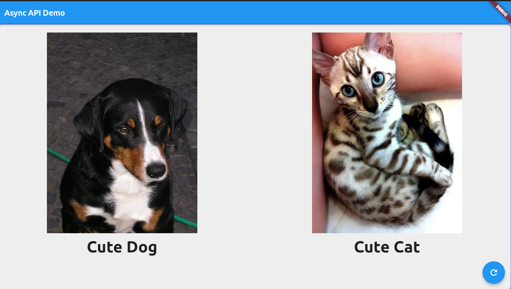
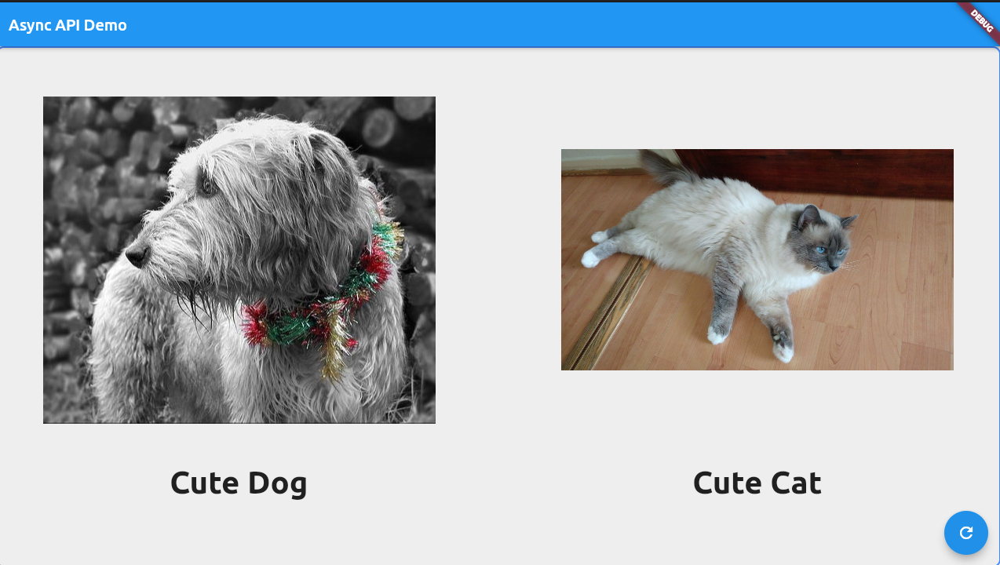
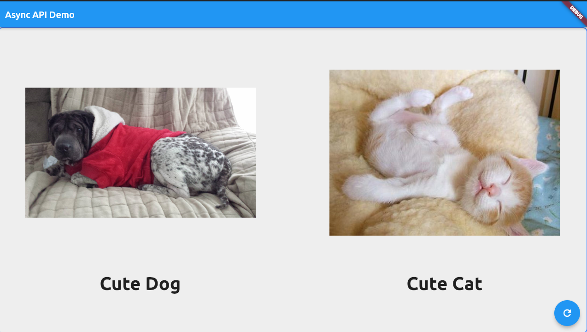
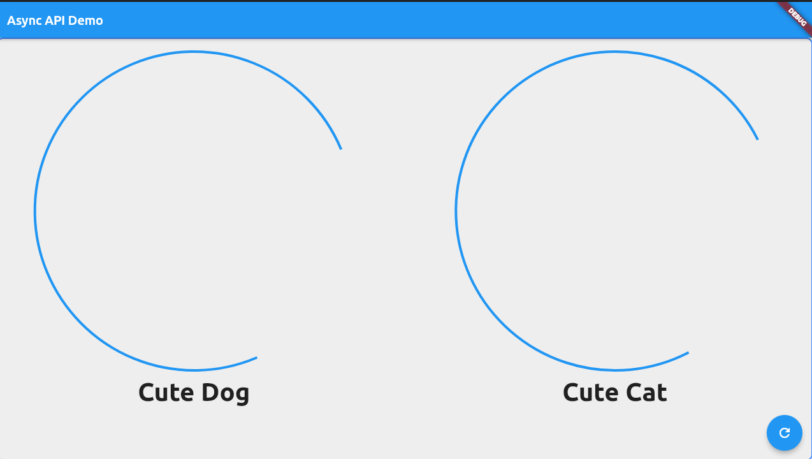

# flutter_cookbook_prac  - DOG & CAT
I tried to generate random dog and cat images using the API. I tried to use async and await to get the data from the API.

## Some Screenshots
### Cute Look
   

### Festive Time
   

### Good Night

### Loading Screen

### Play X Sleep

